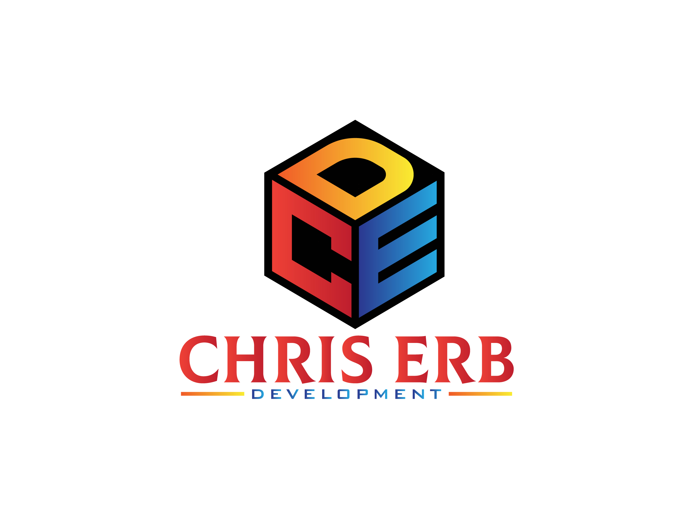

# Christopher Erb Drywall

## Description

The CED site is a web application designed to showcase a construction company and provide customers with easy access to the business. It allows customers to find the company through search engines or advertising efforts. The application also provides management features for customers, projects, and estimates. With an intuitive user interface, users can view and manage customer information, project details, and estimates. The primary goal of this application is to streamline project tracking, customer communication, and estimate generation.

## Technologies Used

- Frontend: React, React Router, Axios, HTML, CSS, Javascript
- Backend: Django, Django REST framework, PostgreSQL, Python
- Problem Solving Resources: [Stack Overflow](https://stackoverflow.com/), [ChatGPT](https://chat.openai.com/)
- Planning: [Trello](https://trello.com/b/DUr0kzPW/chriserbdrywall)

## Getting Started

To get started, you can access the deployed site and Trello board for this project:

- Deployed Site: [CED Site]()
- Trello Board: [Trello Link](https://trello.com/b/DUr0kzPW/chriserbdrywall)

## Screenshots

## Future Updates

- Flesh out the projects page with more concrete information.
- Implement a login function to restrict access for certain users.

## Credits

This project was developed by [Christopher Erb](https://www.chriserb.dev). For any questions, suggestions, or inquiries, you can reach me at:

- [Email Me](mailto:ChristopherErb01@gmail.com)
- [LinkedIn](https://www.linkedin.com/in/christophererb1/)
